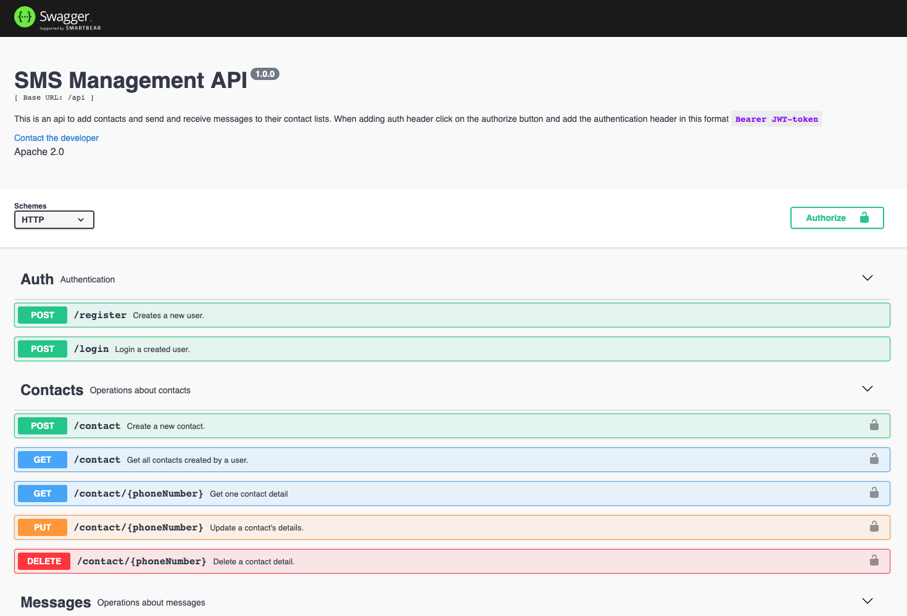

# SMS API
This is an sms api that allows people to create contacts, and send messages to their contacts

## Requirements
- Node
- Express
- MongoDB
- Mongoose ORM

## How to Test
- Clone the branch `git clone https://github.com/lukorito/sms-management-api.git`
- `cd sms-management-api`
- Run `yarn`
- create a `.env` file with details as specified in `env-example`
- Run `yarn start` to start the application

## Screenshot

